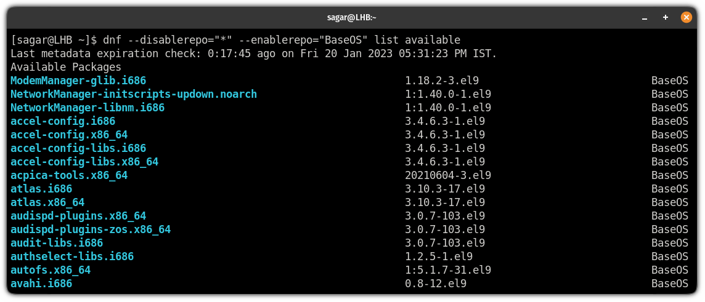

# Repositorios:
  
Rocky Linux proporciona un conjunto diferente de repositorios base para cada versión principal. También hay otros aprobados por la comunidad que se pueden instalar desde los repositorios adicionales.

Esta distribución admite tres tipos de repositorios que se incluyen por defecto o se pueden instalar manualmente:

* Base:
Los repositorios por defecto que vienen preinstalados en Rocky Linux.
* Extra:
Contiene paquetes adicionales destinados a mejorar la funcionalidad de tu sistema. Algunos de ellos son necesarios para la instalación de los repositorios aprobados por la comunidad.
* Aprobados por la comunidad:
Repositorios de terceros proveedores que contienen paquetes no oficiales. También están disponibles para otras distribuciones Linux empresariales.
